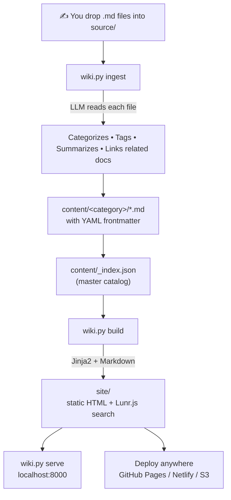

# 📚 Markbase

**A self-organizing markdown wiki, powered by an LLM.**

Drop raw `.md` notes into a folder. An LLM reads each one, files it into a category, tags it, summarizes it, and links it to related docs. Run one command and get a fast, searchable static site — no database, no server framework, deployable anywhere.

```
you write notes  →  wiki.py ingest  →  wiki.py build  →  a searchable static site
```

---

## How it works



The first time you run the tool, it interviews you: what's this wiki for, what should it be called, what categories make sense. It uses your answers to generate `wiki.config.json` — so every wiki fits the person running it.

---

## ✨ Features

- **Zero manual filing** — the LLM decides category, tags, title, and summary for every note
- **Related-docs detection** — the LLM links new notes to existing ones by topic
- **Frontmatter-aware** — re-ingesting a file preserves any fields you've already set by hand
- **Client-side search** — Lunr.js, no backend, works on any static host
- **Clean, responsive design** — collapsible sidebar, tag pills, code blocks with syntax-friendly styling, mobile hamburger menu
- **Provider-flexible** — works with Anthropic, OpenAI, or any OpenAI-compatible free API (Groq is wired in out of the box)
- **Pure static output** — the built `site/` folder is just HTML/CSS/JS; host it anywhere

---

## 📁 Project structure

```
markbase/
├── wiki.py                 # CLI entrypoint — setup, ingest, build, serve, status
├── llm.py                  # LLM client (Anthropic / OpenAI / OpenAI-compatible)
├── builder.py               # Static site generator (Jinja2 + markdown + Lunr index)
├── requirements.txt
├── .env.example             # Copy to .env and add your API key
├── wiki.config.json          # Generated by `wiki.py setup` — your wiki's identity
├── source/                  # Inbox — drop raw .md files here
├── content/                  # Organized output — the LLM sorts files here
│   └── _index.json           # Master document catalog
├── templates/                # Jinja2 HTML templates
│   ├── base.html             # Sidebar shell + search overlay
│   ├── home.html
│   ├── page.html
│   └── category.html
├── static/
│   ├── style.css
│   └── search.js
└── site/                     # Generated static site (gitignored)
```

---

## 🚀 Quick start

### 1. Install dependencies

```bash
git clone <this-repo>
cd markbase
pip install -r requirements.txt
```

### 2. Get a free LLM API key

Pick one — the setup wizard will ask which:

| Provider | Env var | Free tier | Get a key |
|---|---|---|---|
| **Groq** (recommended) | `GROQ_API_KEY` | ✅ No credit card, fast | [console.groq.com](https://console.groq.com) |
| Anthropic | `ANTHROPIC_API_KEY` | Paid | [console.anthropic.com](https://console.anthropic.com) |
| OpenAI | `OPENAI_API_KEY` | Paid | [platform.openai.com](https://platform.openai.com) |

Groq exposes an OpenAI-compatible endpoint, so it works via the same client code as OpenAI — just a different base URL under the hood.

### 3. Run the setup wizard

```bash
python wiki.py setup
```

It asks for your provider + API key (saved to `.env`), then interviews you conversationally:

```
Markbase: What will this wiki be about? Describe the topics or
domain you'll be documenting.

You: Personal notes on backend engineering — databases, APIs, infra

Markbase: How about "Backend Notes" as the wiki name? Or tell me
what you'd prefer.
...
```

At the end it writes `wiki.config.json`, creates your category folders, and you're ready to go.

### 4. Add notes and ingest them

```bash
# drop some .md files into source/, then:
python wiki.py ingest

  ✓ Getting Started with Docker → devops/getting-started-with-docker
  ✓ Postgres Indexing Strategies → databases/postgres-indexing-strategies

Ingested 2 file(s).
```

Each file gets a category, tags, a summary, and links to related docs — all decided by the LLM. Existing frontmatter fields are never overwritten.

### 5. Build and browse

```bash
python wiki.py serve
# Serving site/ at http://localhost:8000
```

Open it in a browser — search icon in the sidebar, click any category, done.

---

## 🖥️ CLI reference

| Command | What it does |
|---|---|
| `wiki.py setup` | First-time interview — creates `wiki.config.json` |
| `wiki.py ingest [FILE]` | Categorize & file everything in `source/`, or a single file |
| `wiki.py ingest --dry-run` | Categorize using local heuristics instead of calling the LLM (no API key needed — handy for testing) |
| `wiki.py build` | Generate the static site into `site/` |
| `wiki.py serve [--port PORT]` | Build, then serve locally (default port 8000) |
| `wiki.py status` | Doc counts per category, top tags, pending files, last build time |

---

## ⚙️ Configuration — `wiki.config.json`

Generated by `setup`, but fully hand-editable:

```json
{
  "name": "My Knowledge Base",
  "description": "Personal notes on software engineering",
  "llm": {
    "provider": "groq",
    "model": "llama-3.3-70b-versatile"
  },
  "categories": [
    { "name": "Programming", "slug": "programming", "description": "Languages, frameworks, code patterns" },
    { "name": "Uncategorized", "slug": "uncategorized", "description": "Documents that don't fit elsewhere" }
  ],
  "tags": ["python", "docker", "tutorial"],
  "source_dir": "source",
  "content_dir": "content",
  "output_dir": "site"
}
```

New categories the LLM invents during ingestion are appended here automatically. `"Uncategorized"` always exists as a fallback.

---

## 📝 Frontmatter schema

Every document in `content/` carries YAML frontmatter:

```yaml
---
title: "Getting Started with Docker"
slug: "getting-started-with-docker"
category: "devops"
tags: [docker, tutorial, containers]
summary: "Basic Docker commands and concepts for beginners"
created: "2024-01-15"
modified: "2024-01-15"
related: ["kubernetes-basics"]
status: "published"
---
```

Set any of these fields yourself before ingesting, and the LLM will leave them alone on re-ingest.

---

## 🔍 Search

Search is entirely client-side: `wiki.py build` writes `search-index.json` (title, tags, summary, body excerpt per doc), and `static/search.js` loads it into a [Lunr.js](https://lunrjs.com/) index in the browser. Click the search button in the sidebar, or it's available on every page — no server, no database.

---

## 🎨 Customizing the look

- Colors, spacing, and the sidebar width are CSS custom properties at the top of `static/style.css` — change a few variables to re-theme the whole site
- Layout comes from `templates/*.html` (Jinja2) — edit these to change page structure
- Everything renders through `base.html`, so sidebar/search changes apply site-wide

---

## 🧩 Adding another LLM provider

Any OpenAI-compatible API can be added in a few lines. In `llm.py`:

```python
OPENAI_COMPATIBLE_BASE_URLS = {
    "groq": "https://api.groq.com/openai/v1",
    "your-provider": "https://api.your-provider.com/v1",
}
```

Then add its default model to `DEFAULT_MODELS` and its env var name to `ENV_VAR_NAMES` in `wiki.py`.

---

## 🛠️ Requirements

- Python 3.9+
- `anthropic`, `openai`, `python-frontmatter`, `python-slugify`, `markdown`, `Jinja2`, `python-dotenv` (see `requirements.txt`)
- An API key from at least one supported provider

---

## Troubleshooting

| Problem | Fix |
|---|---|
| `No wiki.config.json found` | Run `python wiki.py setup` first |
| `No files to ingest.` | Drop `.md` files into `source/` |
| Ingest fails with an API error | Check your key in `.env` matches the provider in `wiki.config.json` |
| Want to test without an API key | Use `python wiki.py ingest --dry-run` |
